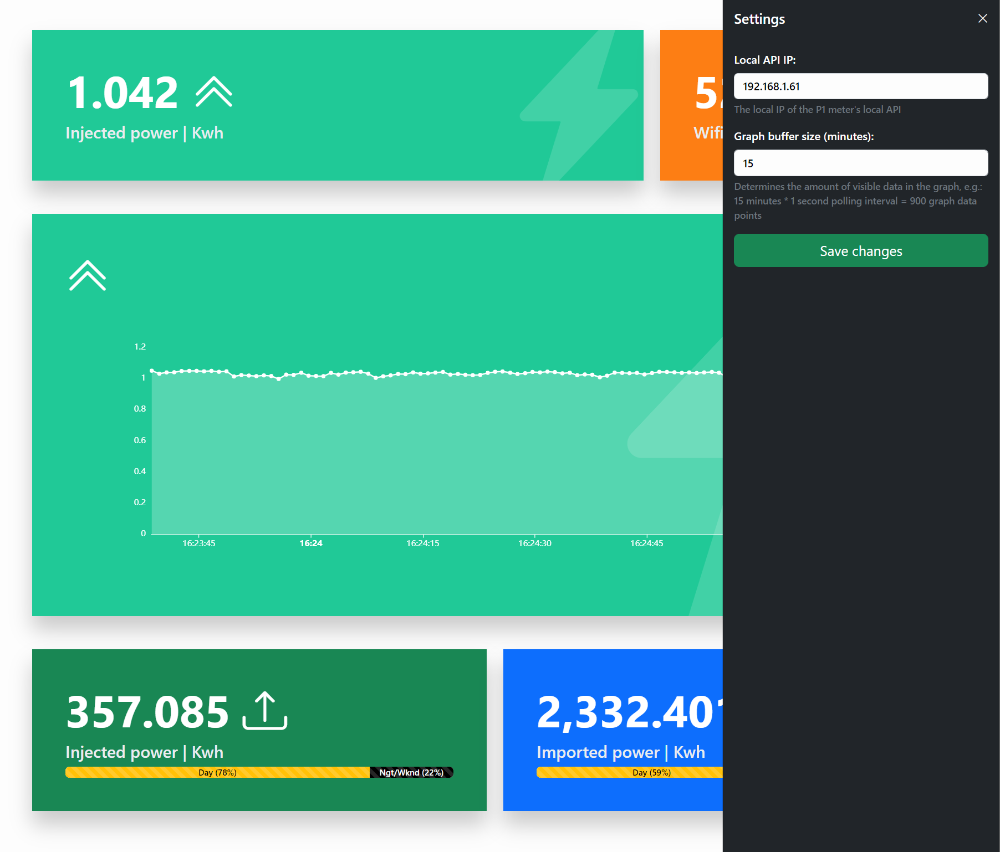

# HomeWizard Local Energy

A responsive dashboard compatible with [HomeWizard's P1 Energy Meter](https://www.homewizard.com/).
- The dashboard relies on the [P1's Local API](https://homewizard-energy-api.readthedocs.io/) being enabled

## Features

### Dashboard

The widgets dynamically change their colour & icon based injection v.s. importing or based on quality (e.g. wi-fi strength). 

#### Live power data
The P1 meter is pollable each 1s, _this rate is used & hard-coded_. 
- View the current (live) amount of power you are injecting (or importing)
- View a graph of the current (live) amount of power you are injecting (or importing)
- View the current (live) wi-fi strength of the P1 Meter

#### Historical power data
- View the historical amount of power you have injected (day v.s. night / weekend)
- View the historical amount of power you have imported (day v.s. night / weekend)

### Settings

The following settings can be changed using the gear icon on the top-right.
- The local IP of the P1 meter's local API
- The buffer size in minutes of data that graph widget will display
  - E.g. with a buffer size of 15 minutes & a hard-coded polling interval of 1 second, the graph will display 900 data points.

_Changing these settings requires a browser refresh, for now._

## Run locally

Run `ng serve` for a dev server. Navigate to `http://localhost:4200/`. The application will automatically reload if you change any of the source files.

## Development Todos
- [ ] Improve reuse between both power-injection components
- [ ] Improve reuse between cards (all components use & style them separately now)
- [ ] Create GitHub action for building artifact and releasing
- [ ] Add widget(s) for Gas
- [x] Create global changeable settings (interval, p1 meter IP, How long to keep graph (15m),...)
- [x] Format hours, minutes, seconds with leading zero's in tooltip of graph
- [x] Remove bootstrap component library
