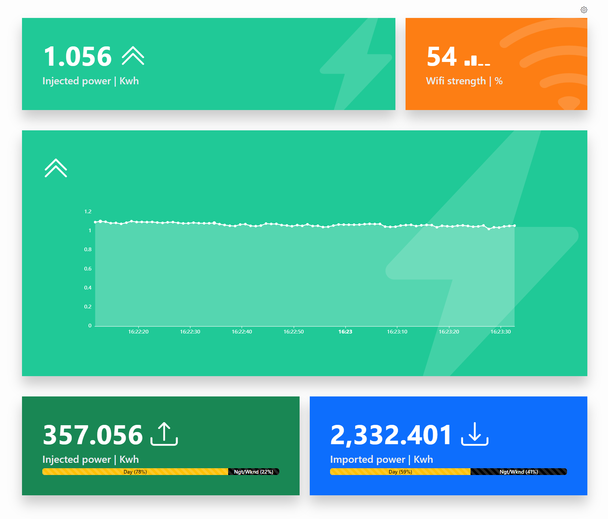

# HomeWizard Local Energy

A responsive dashboard compatible with [HomeWizard's P1 Energy Meter](https://www.homewizard.com/).
- The dashboard relies on the [P1's Local API](https://homewizard-energy-api.readthedocs.io/) being enabled

## Run locally

Run `ng serve` for a dev server. Navigate to `http://localhost:4200/`. The application will automatically reload if you change any of the source files.

## Todo
- [ ] Create global changeable settings (interval, p1 meter IP, How long to keep graph (15m),...)
  - On empty local storage: prompt user for P1 Meter IP
- [ ] Improve reuse between both power-injection components
- [ ] Improve reuse between cards (all components use & style them separately now)
- [ ] Create GitHub action for building artifact and releasing
- [x] Format hours, minutes, seconds with leading zero's in tooltip of graph
- [x] Remove bootstrap component library
