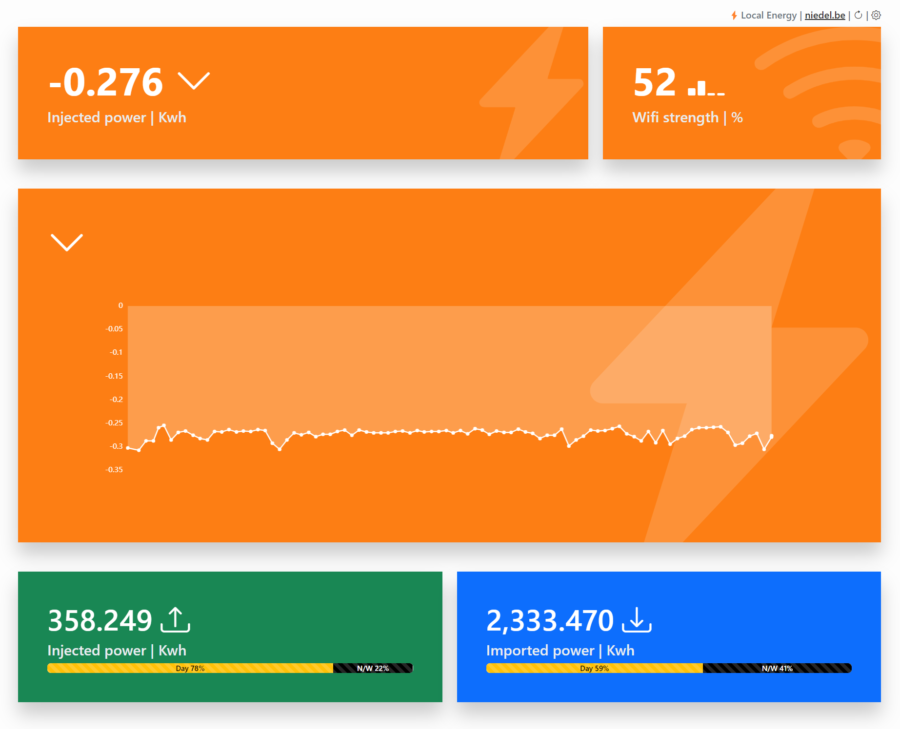

# HomeWizard Local Energy

A responsive dashboard app compatible with [HomeWizard's P1 Energy Meter](https://www.homewizard.com/).
- The app relies on the [Local API](https://homewizard-energy-api.readthedocs.io/) of the P1 meter being enabled.
- The app can only be used locally, on the same network as to which the P1 meter is connected (except if port forwarding is enabled).

The Dashboard can be built and used as:
- A Web-app
- An Android app

## Features

### Dashboard

_The live widgets dynamically change their colour & icon._

#### Live power data
The P1 meter is pollable each 1s, _this rate is used & hard-coded_. 
- View the current (live) amount of power you are injecting (or importing).
- View a graph of the current (live) amount of power you are injecting (or importing).
- View the current (live) wi-fi strength of the P1 Meter.

#### Historical power data
- View the historical amount of power you have injected (day v.s. night / weekend).
- View the historical amount of power you have imported (day v.s. night / weekend).

### Settings

The following settings can be changed using the gear icon on the top-right.
- The local IP of the P1 meter's local API.
- The buffer size (in minutes) of the data that the graph widget will display.
  - E.g. with a buffer size of 15 minutes & a hard-coded polling interval of 1 second, the graph will display 900 data points.
- Show or hide the x-axis labels of the graph.

## Web app

Run `npm run start` for a dev server. 
- Navigate to `http://localhost:4200/`. The application will automatically reload if you change any of the source files.

To build the web app, use:
- `npm run build`

## Android app

Capacitor is used to convert the Angular web-app to an Android app.
- The resulting android source code is under version control & be found in `/android`.

### Development
Create the Android project (once per local repo)
- `npx cap add android`

Sync the web-app with the Android app
- Use `npm run build` (as it includes the `cap sync` command).

> `android:usesCleartextTraffic="true"` needs to be added to the Android manifest (application element) to allow for http communication with the local API.

For building the Android app as an APK, open Android Studio using:
- `npm run android`

## Development Todos
- [ ] Improve reuse between both power-injection components
- [ ] Improve reuse between cards (all components use & style them separately now)
- [ ] Create GitHub action for building artifact and releasing
- [ ] Add widget(s) for Gas
- [x] Create global changeable settings (interval, p1 meter IP, How long to keep graph (15m),...)
- [x] Format hours, minutes, seconds with leading zero's in tooltip of graph
- [x] Remove bootstrap component library
